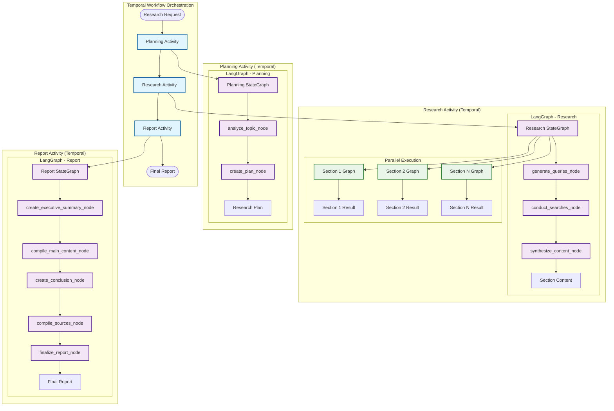

# POC: Temporal + LangGraph Integration 
## Candidate: Deep Research Agent Workflow

A proof-of-concept research assistant that demonstrates how to combine Temporal workflow orchestration with LangGraph's intelligent graph-based workflow management for building robust AI agent workflows.

## Motivation

Building production AI agent workflows requires both **intelligent decision-making** and **distributed reliability**:

- **LangGraph**: Excellent for AI agent logic but **core is not distributed** - runs on single processes without built-in scaling
- **Temporal**: World-class distributed orchestration that can **make any workflow distributed**

This POC shows how **Temporal distributes LangGraph workflows** to achieve **intelligent AND scalable** AI systems:

```
🤖 LangGraph (Intelligence)  +  ⚡ Temporal (Distribution)  =  🚀 Scalable AI Workflows
```

## Architecture

### 🔄 Integration Pattern

**Temporal Level**: Orchestrates three main activities with durable execution, fault tolerance, and parallelization

**LangGraph Level**: Each Temporal activity contains its own StateGraph with nodes, edges, and conditional logic



## Usage

### 🏃 Quick Start

1. **Setup environment**:
   ```bash
   # Create virtual environment
   uv venv
   source .venv/bin/activate  # On Windows: .venv\Scripts\activate
   
   # Install dependencies
   uv pip install -e .
   ```

2. **Configure environment** (create `.env` file):
   ```env
   OPENAI_API_KEY=your_key_here   
   # or
   ANTHROPIC_API_KEY=your_key_here
   TAVILY_API_KEY=your_key_here
   ```

3. **Start Temporal server**:
   ```bash
   # Start Temporal development server
   temporal server start-dev
   ```

4. **Start the worker** (in a separate terminal):
   ```bash
   python -m research_assistant_langgraph worker
   ```

5. **Run research** (in a separate terminal):
   ```bash
   python -m research_assistant_langgraph research "quantum computing applications"
   ```

6. **Inspect the web UI console**:
   ```
   Open http://localhost:8233 in your browser to monitor workflow execution,
   view activity logs, and inspect the research results
   ```

### 🎛️ Advanced Usage

```bash
# Custom sections and search depth
python -m research_assistant_langgraph research "climate change impacts" 4 2

# Using module components directly
python -m research_assistant_langgraph.worker
python -m research_assistant_langgraph.client "artificial intelligence ethics" 3 2
```

## POC Assessment

### ✅ **Pros**

- **Temporal Makes It Distributed & Durable**: LangGraph workflows become distributed, fault-tolerant, and persistent across worker nodes
- **Get Temporal Abilities for Free**: Enterprise monitoring, scheduling, versioning, time-based triggers, and replay capabilities
- **Clear Separation of Concerns**: Temporal handles orchestration/reliability, LangGraph handles intelligence/decision-making
- **Production-Ready Infrastructure**: Built-in observability, metrics, and operational tooling
- **Scalable Worker Architecture**: Activities can run across multiple workers and auto-scale based on load
- **Robust Error Handling**: Exponential backoff retries, timeout management, and failure recovery

### ❌ **Cons**

- **LangGraph Wrapped as Single Activity**: Not workflow-to-workflow integration - each LangGraph becomes one Temporal activity
- **Stitching at Temporal Level**: Each Temporal activity wraps a standalone LangGraph graph; complex flows require Temporal-level coordination
- **Potential Workflow Level Collisions**: Two workflow paradigms may conflict - Temporal's deterministic requirements vs LangGraph's dynamic nature
- **Complexity Overhead**: Developers must understand both Temporal and LangGraph patterns and their interaction
- **Limited Shared State**: LangGraph instances in different activities can't directly share state - must pass through Temporal workflow state
- **Serialization Boundaries**: Data must be serialized between activities, limiting complex object sharing between LangGraph components
- **Temporal Sandbox Restrictions**: LangChain imports require careful passthrough configuration due to Temporal's deterministic execution requirements

## Conclusion

This POC successfully demonstrates that **Temporal + LangGraph integration is possible in some way**.


**However, the integration comes with significant trade-offs:**

- **Not Intuitive**: Requires deep understanding of both frameworks and their interaction patterns
- **High Maintenance**: Complex debugging across two different workflow paradigms  
- **Obscured LangGraph Logic**: Temporal workflow-level stitching abstracts away LangGraph's native workflow visibility
- **Split Observability**: Debugging LangGraph components requires jumping to separate observability tools dedicated to LangGraph, breaking the unified monitoring experience

**Use this pattern for**: Production AI systems where distributed reliability outweighs operational complexity.

**Avoid for**: Most scenarios - consider simpler alternatives unless you specifically need Temporal's distributed capabilities.

**Bottom line**: While technically feasible, this integration sacrifices simplicity and observability for distributed reliability. Choose carefully.
